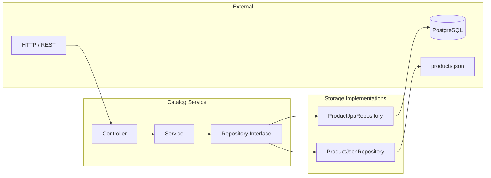
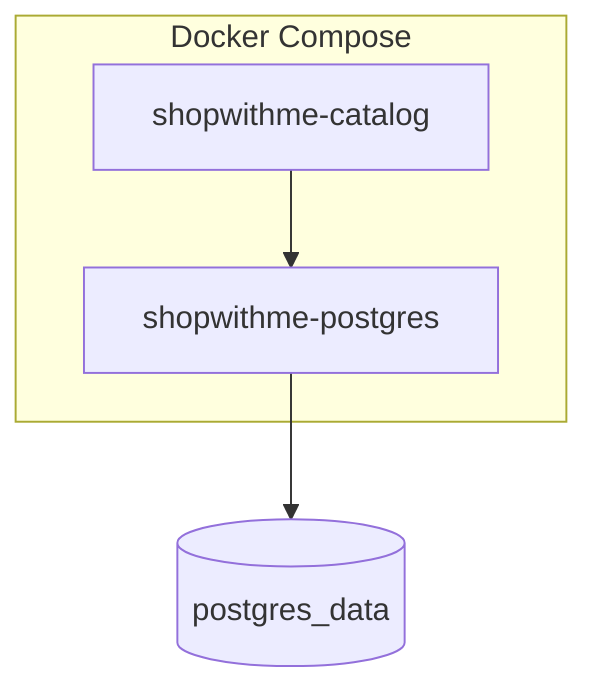

# Architecture

## Overview

ShopWithMe is an e-commerce platform built as microservices. Each service owns a bounded domain and communicates over HTTP.

## High-Level Diagram

```mermaid
flowchart TB
    subgraph Clients
        Browser[Browser / Frontend]
        Mobile[Mobile App]
    end

    subgraph API Gateway["API Gateway (future)"]
    end

    subgraph Services["Microservices"]
        Catalog[Catalog Service]
        Order[Order Service]
        User[User Service]
    end

    subgraph Data["Data Stores"]
        PG[(PostgreSQL)]
        JSON[(products.json)]
    end

    Browser --> API Gateway
    Mobile --> API Gateway
    API Gateway --> Catalog
    API Gateway --> Order
    API Gateway --> User

    Catalog -.->|postgres profile| PG
    Catalog -.->|json profile| JSON
```

## Catalog Service Architecture



## Layered Design

| Layer | Responsibility | Example |
|-------|----------------|---------|
| **Controller** | HTTP, request/response mapping | `ProductController` |
| **Service** | Business logic, orchestration | `ProductService` |
| **Repository** | Data access abstraction | `IProductRepository` |
| **Model** | Domain and DTOs | `Product`, `CreateProductRequest` |

## Storage Strategy

The catalog supports pluggable storage via Spring profiles:

| Profile | Implementation | Use Case |
|---------|----------------|----------|
| `json` | `ProductJsonRepository` | Local dev, simple deployments |
| `postgres` | `ProductJpaRepository` | Production, persistence |

Profile is set via `CATALOG_STORAGE` env var or `spring.profiles.active`.

## Deployment



- **Containers**: `shopwithme-catalog`, `shopwithme-postgres`
- **Ports**: 8081 (catalog), 5432 (postgres)
- **Volume**: PostgreSQL data persisted in `postgres_data`
